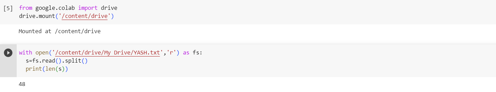

# Word-count
## AIM:
To write a python program for getting the word count from a text.
## EQUIPEMENT'S REQUIRED: 
PC
Anaconda - Python 3.7
## ALGORITHM: 
### Step 1:
Create a file using Note pad extension.txt

### Step 2: 
 Open google colab and mount the google drive with your email id
 
### Step 3: 
Now open the text file in read mode

### Step 4:  
Then read and split the file using the read() and split() which is assigned to a variable

### Step 5: 
Print the assigned variable's length using len()
### Step 6: 
End the program 

## PROGRAM:
#Count the number of words in a text file
```python
from google.colab import drive 
drive.mount('/content/drive')

with open('/content/drive/My Drive/YASH.txt','r') as fs:
  s=fs.read().split()
  print(len(s))
```

### OUTPUT:




## RESULT:
Thus the program is written to find the word count from a text.
